# SerpAPI System - Visual Function Map

## 🗺️ Complete System Function Mapping with Visual Flowcharts

---

## 📊 System Overview Map

```mermaid
mindmap
  root((SerpAPI System))
    Search Engine
      Enhanced Flight Search Client
        search_flights()
        _validate_search_params()
        _extract_airline_iata_code()
        _store_airline_info()
        _store_airport_info()
        _calculate_cache_age()
    // Deprecated (Sept 2025): Approval Required Client (removed)
    API Integration
      SerpAPI Client
        search_round_trip()
        search_one_way()
        search_multi_city()
        _validate_parameters()
        _build_search_url()
        _make_request()
        _parse_response()
        _handle_api_errors()
      Rate Limiter
        check_rate_limit()
        wait_if_needed()
        _calculate_delay()
    Data Management
      Database Helper
        insert_api_response()
        get_api_responses()
        get_database_stats()
        _update_metadata()
      Flight Search Cache
        search_cache()
        store_flight_data()
        cleanup_old_data()
        _generate_cache_key()
  // Deprecated (Sept 2025): Approval System (APICallMonitor)
    Validation
      Flight Search Validator
        validate_airport_code()
        validate_date_format()
        validate_passenger_count()
        _check_date_logic()
```

---

## 🔍 Main Search Flow Functions

### Primary Search Function: `search_flights()`


### Cache Management Functions


### Data Extraction Functions

```mermaid
graph TD
    A[_extract_airline_iata_code] --> B{Valid String?}
    B -->|No| C[return 'Unknown']
    B -->|Yes| D[Strip Whitespace]
    D --> E[Apply Regex Pattern]
    E --> F[^([A-Z]{2,3})\s*\d+]
    F --> G{Regex Match?}
    G -->|No| C
    G -->|Yes| H[Extract Group 1]
    H --> I{Length 2-3?}
    I -->|No| C
    I -->|Yes| J{All Alphabetic?}
    J -->|No| C
    J -->|Yes| K[return IATA Code]
    
    L[_store_airline_info] --> M[Extract Required Fields]
    M --> N{Record Exists?}
    N -->|Yes| O[UPDATE last_seen]
    N -->|No| P[INSERT OR IGNORE]
    O --> Q[Log Update]
    P --> R[Log Insert]
    
    S[_store_airport_info] --> T[Extract Airport Data]
    T --> U[Normalize Country Code]
    U --> V{Airport Exists?}
    V -->|Yes| W[UPDATE last_seen]
    V -->|No| X[INSERT OR IGNORE]
    W --> Y[Log Airport Update]
    X --> Z[Log Airport Insert]
    
    style A fill:#e3f2fd
    style L fill:#f1f8e9
    style S fill:#fce4ec
```

---

## 🔐 (Removed) Approval System Functions

The interactive approval workflow (search_flights_with_approval, request_api_approval, approve_and_execute, cost prompts) was removed in the September 2025 consolidation. The system now performs a direct cache-first search and only calls the external API when no fresh cached data exists.

If future governance or quota tracking is required, implement it as a non-blocking async metrics collector rather than an inline approval gate.

// Historic cost calculation diagrams removed (subsystem deprecated)

---

## 🗄️ Database Functions

### Core Database Operations


### Cache-Specific Operations


---

## 🌐 API Client Functions

### Request Processing


### Parameter Validation

```mermaid
graph TD
    A[_validate_parameters] --> B[Check Required Fields]
    B --> C{departure_id valid?}
    C -->|No| D[Add to Error List]
    C -->|Yes| E[Check arrival_id]
    E --> F{arrival_id valid?}
    F -->|No| D
    F -->|Yes| G[Check Date Format]
    G --> H{Date valid?}
    H -->|No| D
    H -->|Yes| I[Check Passenger Counts]
    I --> J{Passengers valid?}
    J -->|No| D
    J -->|Yes| K[Check Optional Parameters]
    K --> L[Validate Currency]
    L --> M[Validate Travel Class]
    M --> N{All Valid?}
    N -->|Yes| O[return (True, [])]
    N -->|No| P[return (False, errors)]
    D --> P
    
    style A fill:#f3e5f5
    style O fill:#c8e6c9
    style P fill:#ffcdd2
```

### Response Parsing


---

## 🔄 Integration Flow

### Complete Search Integration

```mermaid
graph TD
    User[👤 User Request] --> Entry[🚪 Entry Point]
    Entry --> Cache[💾 Cache Check]
    Cache --> CacheHit{🎯 Hit?}
    CacheHit -->|Yes| Fresh{🕐 Fresh?}
    Fresh -->|Yes| Return[📤 Return Data]
    Fresh -->|No| Clean[🧹 Cleanup]
  CacheHit -->|No| Clean[🧹 Cleanup]
  Clean --> API[🌐 Call API]
    API --> Success{✅ Success?}
    Success -->|Yes| Process[⚙️ Process Data]
  Success -->|No| Error[❌ Return Error]
  Process --> Store[💾 Store Results]
  Store --> Extract[🔤 Extract IATA]
  Extract --> UpdateRef[📊 Update References]
  UpdateRef --> Return
    
    style User fill:#e3f2fd
    style Return fill:#c8e6c9
    style Error fill:#ffcdd2
    style Reject fill:#ffcdd2
```



### Function Call Hierarchy


---

## 📈 Performance Function Map

### High-Performance Functions
- `search_cache()` - 5-15ms (indexed lookup)
- `_generate_cache_key()` - <1ms (hash calculation)
- `validate_airport_code()` - <1ms (regex check)

### Medium-Performance Functions  
- `store_flight_data()` - 50-200ms (multiple inserts)
- `cleanup_old_data()` - 100-500ms (batch operations)
- `_parse_response()` - 20-100ms (JSON processing)

### User-Interactive Functions
- `search_flights()` with API - 2-5 seconds (network call)

---

*This visual function map provides comprehensive flowcharts and diagrams for every major function in the SerpAPI Flight Search System, showing the complete execution flow and function relationships.*
