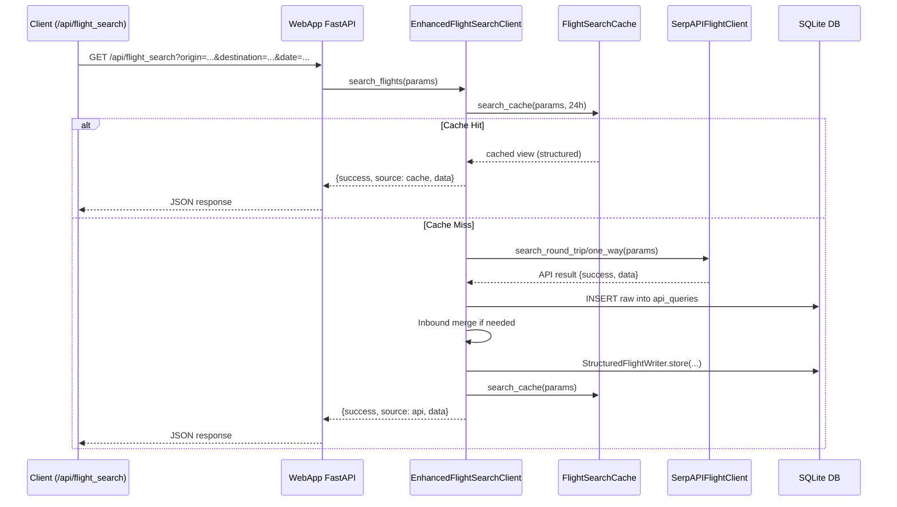
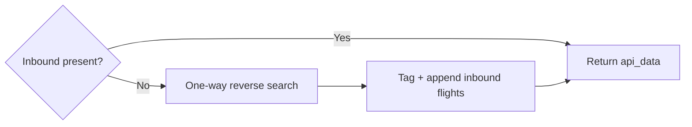
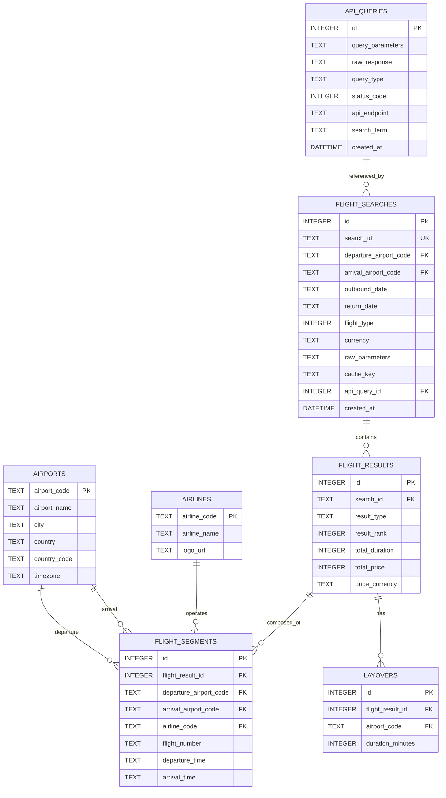

# SerpAPI Flight Data System — Architecture & Core Components (Comprehensive)

Date: 2025-09-12
Branch: master

## Executive Summary

This document provides a comprehensive architecture overview of the SerpAPI Flight Data System, covering system boundaries, deployment topology, core modules, data model, API surface, observability, security, configuration, operations, and roadmap. It synthesizes the current codebase (Main, DB, WebApp) and living documentation under `MD/`.

Key tenets:
- Cache-first flight search with full raw retention and normalized structured storage in SQLite.
- WebApp FastAPI layer exposing authentication, search API, admin helpers, and optional SPA hosting.
- Strict schema modification policy (owner approval required), with version manifest, drift detection, and checksum snapshot.
- Lightweight in-memory metrics and structured JSONL event logging for observability.

---

## High-Level Architecture

```mermaid
flowchart LR
  subgraph Client
    U[User]
    SPA[React SPA (optional build)]
  end

  subgraph WebApp[FastAPI WebApp]
    API[/APIs: /api/*, /auth/*, /health, /metrics/]
    Auth[JWT Auth & Users]
    UI[SPA Hosting (optional)]
  end

  subgraph Core[Main Python Package]
    EFS[EnhancedFlightSearchClient]
    Cache[FlightSearchCache]
    SAPI[SerpAPIFlightClient]
    Svc1[InboundMergeStrategy]
    Svc2[WeekRangeAggregator]
    Persist[StructuredFlightWriter]
    Valid[Validation & RateLimiter]
    Obs[Metrics + Structured Logging]
  end

  subgraph Data[SQLite DB + Files]
    DB[(DB/Main_DB.db)]
    Logs[/logs/*.jsonl, *.log/]
  end

  U-- HTTP -->API
  SPA-- fetch -->API
  UI-- serves -->U
  API-- request -->EFS
  EFS-- cache check -->Cache
  EFS-- call if miss -->SAPI
  EFS-- write structured -->Persist
  Persist-- SQL -->DB
  Cache-- SQL -->DB
  SAPI-- store raw -->DB
  EFS-- merge/aggregate -->Svc1 & Svc2
  EFS-- events/metrics -->Obs
  WebApp-- logs -->Logs
```

---

## Component Inventory

### WebApp (FastAPI)
- Location: `WebApp/app`
- Entry: `WebApp/app/main.py`
- Responsibilities:
  - Serve API endpoints: `/api/flight_search`, airports and airlines lookup, `/health`, optional `/metrics`.
  - JWT-based auth under `/auth/*` with admin utilities; demo users bootstrapped for local testing.
  - Optional single-port SPA hosting (serves `react-frontend/dist` when present).
- Key modules:
  - `core/config.py`: Pydantic settings. `WEBAPP_ENABLE_METRICS` toggles JSON `/metrics`.
  - `auth/*`: models (SQLAlchemy `User`), routes, JWT helpers, hashing.
  - `db/session.py`: SQLAlchemy engine/session; uses `DB/Main_DB.db` by default; test mode `WEBAPP_TESTING=1` uses `WebApp/test_db.sqlite3`.
- Integration:
  - Lazy-instantiates a singleton `EnhancedFlightSearchClient` to avoid duplicate module loads and keep metrics consistent.

### Core (Main)
- Location: `Main/`
- Orchestrator: `enhanced_flight_search.py` — validates, checks cache, calls external API if needed, stores raw+structured, emits events/metrics.
- Supporting modules:
  - `cache.py` — cache key generation, structured cache lookup and cleanup.
  - `serpapi_client.py` — parameter build/validation, retry with jitter, HTTP calls.
  - `services/` — `inbound_merge.py` (ensure return leg), `week_aggregator.py` (7-day searches + price trend summary), `cli_date_parser.py`.
  - `persistence/structured_writer.py` — normalized, idempotent writes to `flight_searches`, `flight_results`, `flight_segments`, `layovers`, `price_insights`, airlines/airports upserts.
  - `core/common_validation.py` — `FlightSearchValidator`, `RateLimiter`.
  - `core/structured_logging.py` — JSONL event logger with rotation.
  - `core/metrics.py` — in-memory counters. Exposed via WebApp `/metrics` when enabled.
  - `constants.py` — `Event` and `Metric` enums and `emit()` helper.

### Data Layer (SQLite)
- Location: `DB/`
- Canonical snapshot: `DB/current_schema.sql` (generated; checksum embedded).
- DB helper: `DB/database_helper.py` — connection bootstrap (WAL, FK), baseline schema versioning, checksum, drift detection, integrity checks, snapshot generation, and raw API I/O.
- Policy: Schema changes must be owner-approved. Raw `api_queries` rows are retained by default (not pruned by cache cleanup).

---

## Request/Processing Flows

### Flight Search (API to Storage)



### Week Range Aggregation

```mermaid
flowchart TD
  Start([start_date]) --> ForEachDay{7 days}
  ForEachDay --> Call[Call EFS.search_flights]
  Call --> Accumulate[Aggregate daily results]
  Accumulate --> PriceTrend[Compute daily min/avg + trend]
  PriceTrend --> Summary[Build summary]
  Summary --> Return[{success, daily_results, best_week_flights, price_trend, summary}]
```

### Inbound Merge (Return Leg Fallback)



---

## API Surface (WebApp)

Public endpoints (selected):
- `GET /` — serves SPA index.html when built; minimal message otherwise.
- `GET /flight-search` — SPA route; same behavior as `/`.
- `GET /dashboard`, `GET /admin` — minimal HTML UIs; admin portal lists users, supports password reset and toggle active.
- `GET /api/flight_search` — query params: `origin`, `destination`, `date`, optional `return_date`, `travel_class`, `one_way`.
- `GET /api/airports/suggest?q=...&limit=10` — code/city/country search.
- `GET /api/airports/by_code?code=...` — single airport details.
- `GET /api/airports/by_codes?codes=AAA,BBB,...` — batch lookup.
- `GET /api/airports/all` — minimal list for client-side caching.
- `GET /api/airlines/by_codes?codes=...` — airline names by codes.
- `GET /health` — simple healthcheck.
- `GET /metrics` — JSON metrics; requires `WEBAPP_ENABLE_METRICS=1` (enabled by default in settings, can be toggled via env).

Auth endpoints (`/auth/*`):
- `POST /auth/register` — create user.
- `POST /auth/login` — returns `{access_token, refresh_token}`.
- `POST /auth/refresh` — exchange refresh for new pair.
- `GET /auth/me` — current user from bearer token.
- Admin: `GET /auth/users`, `POST /auth/users/{id}/password`, `POST /auth/users/{id}/toggle_active`, `GET /auth/logs`.

---

## Data Model (SQLite)

The canonical snapshot is maintained in `DB/current_schema.sql` with a checksum. Core tables include:
- `api_queries` — raw SerpAPI JSON and metadata (`created_at` is authoritative).
- `flight_searches` — one row per search_id; cache_key; parameters; counts.
- `flight_results` — top-level results per search (best/other), rank, totals.
- `flight_segments` — ordered segments per result; airport and airline FKs.
- `layovers` — precomputed layover slices for UI convenience.
- `price_insights` — optional insights block with uniqueness on `search_id`.
- `airports`, `airlines` — reference tables (upserted from payloads when needed).
- `route_analytics` — simple aggregate per route.
- `schema_version`, `migration_history`, `database_metadata` — governance and metadata.

Entity relationships (simplified):



---

## Observability

- Structured Events: `Main/core/structured_logging.py` writes JSONL to `Main/logs/flight_events.jsonl` (configurable via `FLIGHT_JSON_LOG`). Rotation enabled via size limit env.
- Metrics: in-memory counters in `Main/core/metrics.py` (e.g., `api_calls`, `cache_hits`, latency buckets, `structured_storage_failures`).
- WebApp `/metrics`: returns `METRICS.snapshot()` when `WEBAPP_ENABLE_METRICS=1`. Intended for quick diagnostics/tests (not persistent).
- Suggested Next Steps:
  - Optional `/metrics/prometheus` exporter (text format) behind the same flag.
  - Periodic metrics flush to a durable sink (OTel/Prom).
  - Include request IDs and search IDs in HTTP logs for correlation.

---

## Security

- API keys: `SERPAPI_KEY` must come from environment; never stored in plaintext.
- Auth: JWT (HS256) with short-lived access (15m) and refresh (7d). Secrets via `WEBAPP_JWT_SECRET`.
- Password hashing: Argon2 or bcrypt (passlib) used by `WebApp/app/auth/hash.py`.
- Admin surface: JWT-protected admin endpoints; a few demo users are seeded for local/testing convenience.
- Files/Artifacts: WAL/SHM and runtime logs ignored by Git; main DB file is tracked as per current policy.

Threat considerations:
- In-memory metrics are per-process; not tamper-proof; do not expose externally without auth in multi-tenant contexts.
- SQLite concurrency acceptable for current scale; ensure WAL is enabled (it is) and long transactions are avoided.

---

## Configuration

- Core (`Main/config.py`):
  - `SERPAPI_CONFIG`: base_url, engine `google_flights`, timeouts, retry.
  - `DEFAULT_SEARCH_PARAMS`: currency, locale, passengers, class, type.
  - `DATABASE_CONFIG`: `DB/Main_DB.db` path; connection timeout.
  - `PROCESSING_CONFIG`: toggles for auto extraction and analytics.
  - `RATE_LIMIT_CONFIG`: requests/min and hour; toggle limiter.
  - `LOGGING_CONFIG`: classic file log path (structured JSONL uses a separate module).
- WebApp settings (`WebApp/app/core/config.py`):
  - `WEBAPP_JWT_SECRET`, `WEBAPP_ENABLE_METRICS`, `access_token_minutes`, `refresh_token_days`, `algorithm`.
- Environment: `.env` at repo root can be used for local development.

---

## Operations & Deployment

- Local run (single port, Windows PowerShell):
  - `scripts/start-webapp.ps1` launches uvicorn on `127.0.0.1:8000`, killing any existing process on the port; serves SPA if built.
  - `scripts/stop-webapp.ps1` stops listener processes by port.
- React Frontend (optional): build under `WebApp/react-frontend` -> `dist`; assets are mounted at `/assets`.
- CI: GitHub Actions workflow runs pytest on Python 3.11–3.13 and a non-blocking Ruff lint job.

---

## Testing Summary

- Pytest configuration under `pyproject.toml` (`tests` discovery). Recent runs: 50 passing tests; metrics endpoint tests added under WebApp.
- Database integrity utilities: `SerpAPIDatabase.run_integrity_check()` (PRAGMA checks), snapshot generation and checksum verification tested.
- Week aggregator and cache behaviors covered by tests.

---

## Risks, Constraints, and Tradeoffs

- SQLite limits: suitable for single-node scenarios; monitor file size growth due to raw retention; consider WAL checkpointing.
- Metrics: in-memory only; restarts reset counters; for production telemetry, add Prometheus/OTel exporters.
- Schema governance: strict policy protects integrity but adds change overhead; follow documented migration workflow and checksum updates.
- Data normalization relies on payload completeness; writer defensively upserts airports/airlines when missing.

---

## Roadmap (Non-blocking Enhancements)

1. Observability
   - Add Prometheus-format `/metrics` and basic histogram buckets for API latency.
   - Ship logs to a central sink; add request IDs for correlation.
2. WebApp
   - Pagination and filters on `/api/flight_search` results when returning large payloads.
   - Tighten auth defaults (disable demo users outside test mode).
3. Data Layer
   - Optional Git LFS for `DB/Main_DB.db` to reduce repo bloat.
   - Periodic archival/compaction strategy for raw `api_queries`.
4. Quality
   - Reduce Ruff lint debt incrementally; expand type hints.
   - Strengthen tests for retry/jitter branches and inbound merge edge cases.

---

## Appendix A — Event & Metric Taxonomy

- Events (see `Main/constants.py`):
  - `efs.search.start|success|error`, `efs.cache.hit|miss`, `efs.api.request|error`, `efs.store.raw.*`, `efs.store.structured.*`, `efs.inbound.*`, `efs.week.*`.
- Metrics (see `Main/core/metrics.py`):
  - Counters: `api_calls`, `api_failures`, `cache_hits`, `cache_misses`, `retry_attempts`, `structured_storage_failures`.
  - Aggregates: `api_time_ms_total`, `function_calls`, `function_time_ms_total`.
  - Latency buckets: `<250ms`, `<500ms`, `<1000ms`, `≥1000ms`.

## Appendix B — Key Paths & Symbols

- Orchestrator: `Main/enhanced_flight_search.py::EnhancedFlightSearchClient`
- Cache: `Main/cache.py::FlightSearchCache`
- External API client: `Main/serpapi_client.py::SerpAPIFlightClient`
- Writer: `Main/persistence/structured_writer.py::StructuredFlightWriter`
- Services: `Main/services/inbound_merge.py`, `Main/services/week_aggregator.py`
- WebApp entry: `WebApp/app/main.py` (routes and SPA)
- Auth: `WebApp/app/auth/*` (models, routes, jwt)
- DB helper: `DB/database_helper.py`
- Schema snapshot: `DB/current_schema.sql`

```
This document reflects the repository state as of 2025-09-12 and will drift over time. Update alongside code changes and regenerate diagrams to keep accuracy.
```
