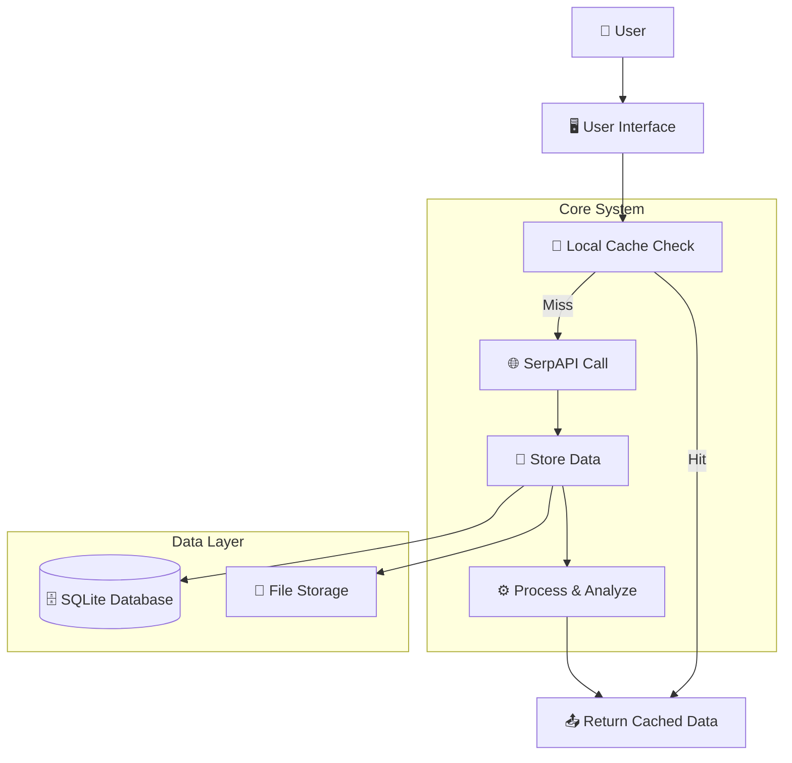
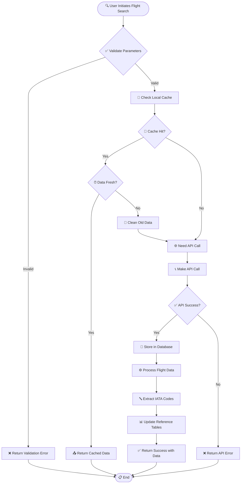
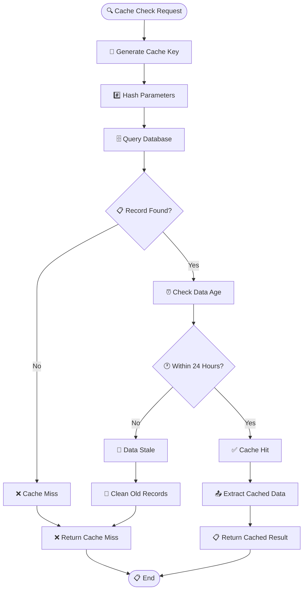
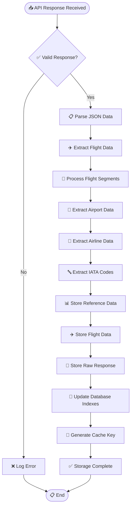
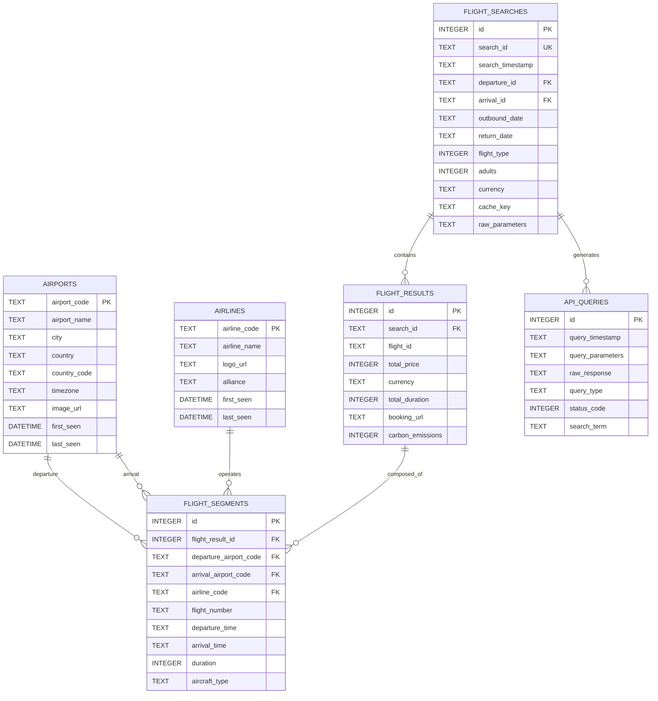
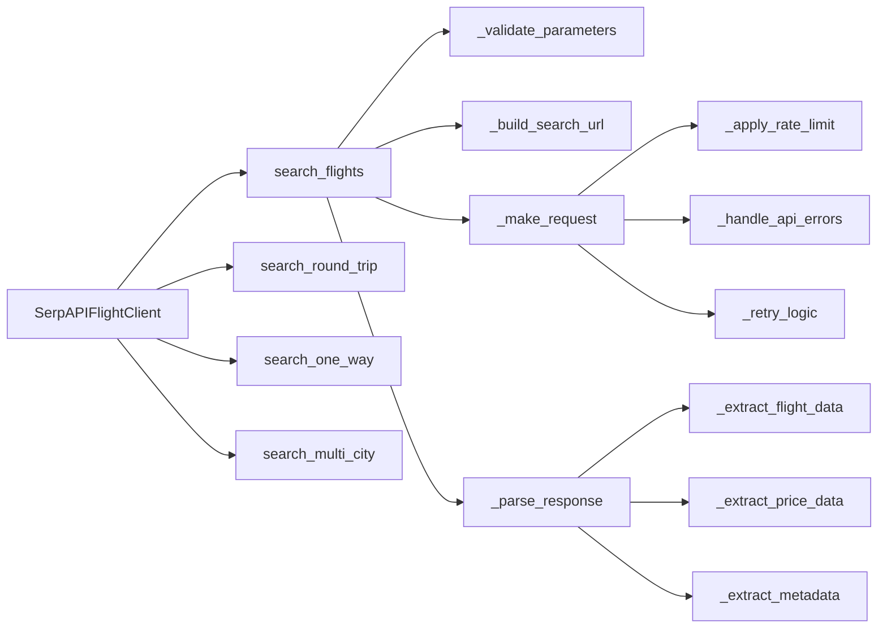
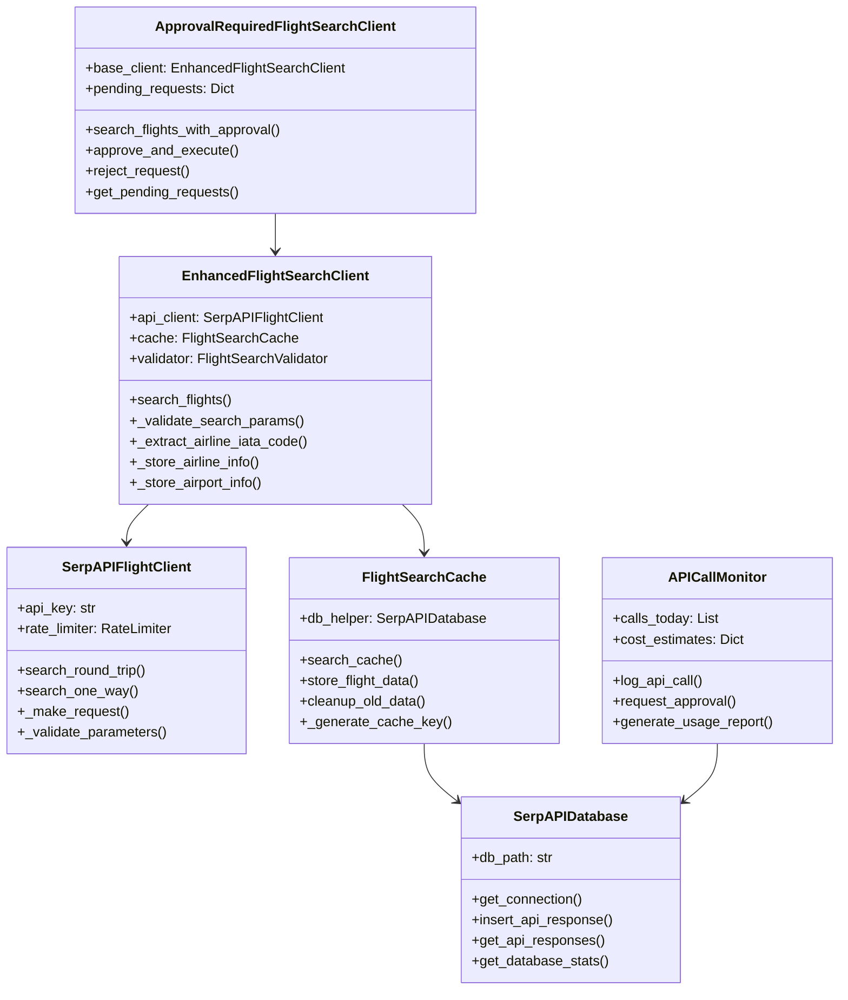

# SerpAPI Flight Search System - Complete Documentation

## � IMPORTANT: Database Schema Modification Policy

**⚠️ CRITICAL RESTRICTION ⚠️**

Database schema changes are **STRICTLY PROHIBITED** unless explicitly double-confirmed by the project owner. 

### Schema Change Policy:
- ❌ **NO** unauthorized schema modifications
- ❌ **NO** table structure changes without approval  
- ❌ **NO** column additions/deletions without explicit consent
- ❌ **NO** index modifications without review
- ✅ **ONLY** data operations (INSERT, UPDATE, DELETE) are permitted

### If Schema Change Required:
1. **STOP** - Do not proceed with any schema changes
2. **DOCUMENT** - Clearly document the proposed change and justification
3. **REQUEST** - Explicitly request approval from project owner
4. **WAIT** - Wait for explicit double-confirmation before proceeding
5. **BACKUP** - Create full database backup before any changes
6. **TEST** - Thoroughly test changes in isolated environment first

### Current Schema Status:
- **Schema File**: `DB/current_schema.sql` (canonical reference)
- **Last Generated**: Auto-generated from production database
- **Tables**: 10 production tables with optimized foreign key relationships
- **Status**: Production-ready and stable

---

## �📋 Table of Contents
1. [System Architecture Overview](#system-architecture-overview)
2. [Core Components](#core-components)
3. [Function Flow Diagrams](#function-flow-diagrams)
4. [Database Schema](#database-schema)
5. [API Integration](#api-integration)
6. [Usage Examples](#usage-examples)
7. [Development Guide](#development-guide)

---

## 🏗️ System Architecture Overview



---

## 🧩 Core Components (Current)

### Enhanced Flight Search Client
`Main/enhanced_flight_search.py` – Unified search, cache-first, week range support, structured storage.

### Flight Search Cache
`Main/cache.py` – Cache key generation, lookup, cleanup (24h TTL).

### Database Helper (Legacy Support)
`DB/database_helper.py` – Underlying DB utilities (some legacy functions retained for reference).

### SerpAPI Client
`Main/serpapi_client.py` – Secure SerpAPI integration.

### Deprecated (Removed) Components
`api_approval_system.py`, `simple_api_approval.py`, `approved_flight_search.py`, demo scripts, analyzer modules – removed; see `DOC_DRIFT_MATRIX.md`.

---

## 🔄 Function Flow Diagrams

### 1. Flight Search Flow (Main Process)



### 2. Database Cache Management Flow



### (Removed) API Approval Flow
The previous interactive approval & cost control layer has been deprecated. All searches now proceed directly after validation using cache-first logic.

### 4. Data Storage and Processing Flow



### 5. Airline IATA Code Extraction Flow

```mermaid
flowchart TD
    Start([🔤 Extract IATA Code]) --> GetFlightNumber[📋 Get Flight Number]
    GetFlightNumber --> ValidateFormat{✅ Valid Format?}
    
    ValidateFormat --> |No| DefaultCode[📝 Use Default Code]
    ValidateFormat --> |Yes| ApplyRegex[🔍 Apply Regex Pattern]
    
    ApplyRegex --> RegexMatch{🎯 Regex Match?}
    RegexMatch --> |No| DefaultCode
    RegexMatch --> |Yes| ExtractCode[🔤 Extract 2-3 Char Code]
    
    ExtractCode --> ValidateIATA{✅ Valid IATA Format?}
    ValidateIATA --> |No| DefaultCode
    ValidateIATA --> |Yes| ReturnCode[📤 Return IATA Code]
    
    DefaultCode --> ReturnDefault[📤 Return "Unknown"]
    
    ReturnCode --> End([📋 End])
    ReturnDefault --> End
```

---

## 🗄️ Database Schema

### Core Tables Structure



---

## 🌐 API Integration

### SerpAPI Client Function Map



---

## 📚 Usage Examples

### Basic Flight Search
```python
from enhanced_flight_search import EnhancedFlightSearchClient

# Initialize client
client = EnhancedFlightSearchClient()

# Search flights (checks cache first)
result = client.search_flights(
    departure_id='POM',
    arrival_id='MNL',
    outbound_date='2025-09-26',
    return_date='2025-10-03',
    adults=1
)

if result['success']:
    print(f"Found {len(result['data']['flights'])} flights")
    print(f"Data source: {result['source']}")  # 'cache' or 'api'
else:
    print(f"Search failed: {result['error']}")
```

### Approval Required Search
```python
from approved_flight_search import ApprovalRequiredFlightSearchClient

# Initialize approval client
client = ApprovalRequiredFlightSearchClient()

# Request search with approval
result = client.search_flights_with_approval(
    departure_id='POM',
    arrival_id='MNL',
    outbound_date='2025-09-26',
    reason='Business travel planning'
)

if result.get('approval_required'):
    request_id = result['approval_request_id']
    print(f"Approval needed. Request ID: {request_id}")
    print(f"Estimated cost: ${result['estimated_cost']:.4f}")
    
    # User approves the request
    final_result = client.approve_and_execute(request_id)
    print(f"Search completed: {final_result['success']}")
```

### Database Analytics
```python
from database_helper import SerpAPIDatabase

# Initialize database
db = SerpAPIDatabase()

# Get statistics
stats = db.get_database_stats()
print(f"Total searches: {stats['total_records']}")

# Get recent searches
recent = db.get_api_responses(query_type='flights', limit=10)
for search in recent:
    params = search['query_parameters']
    print(f"{params.get('departure_id')} → {params.get('arrival_id')}")
```

---

## 👨‍💻 Development Guide

### Class Hierarchy



### Key Design Patterns

1. **Cache-First Strategy**: Always check local database before API calls
2. **Approval Workflow**: Mandatory approval for API calls to manage costs
3. **Data Normalization**: Foreign key relationships to eliminate redundancy
4. **IATA Code Extraction**: Regex-based extraction from flight numbers
5. **Error Handling**: Comprehensive error capture and graceful degradation

### Performance Optimizations

1. **Database Indexes**: Optimized for common query patterns
2. **Cache Keys**: SHA-256 hashing for fast lookups
3. **Data Cleanup**: Automatic removal of stale data (>24 hours)
4. **Batch Operations**: Efficient bulk data insertion
5. **Connection Pooling**: Reuse database connections

---

## 🔧 Configuration

### Environment Setup
```powershell
# Set API key (Windows PowerShell - persists for current user)
[System.Environment]::SetEnvironmentVariable("SERPAPI_KEY", "your_key", "User")

# Or create a .env file at project root (NOT committed) with:
# SERPAPI_KEY=your_key
# Plaintext standalone key files (e.g. Temp/api_key.txt) are deprecated and disallowed.
```

### Database Configuration
```python
# config.py
DATABASE_CONFIG = {
    'path': '../DB/Main_DB.db',
    'cache_duration_hours': 24,
    'cleanup_interval_hours': 6
}

SERPAPI_CONFIG = {
    'base_url': 'https://serpapi.com/search',
    'timeout': 30,
    'max_retries': 3
}
```

---

## 🚀 Getting Started

1. **Clone/Setup**: Navigate to project directory
2. **Dependencies**: `pip install -r requirements.txt`
3. **API Key**: Set SERPAPI_KEY environment variable
4. **Database**: Run `python DB/schema_upgrade.py`
5. **Test**: Run `python Main/flight_system_demo.py`

---

*This documentation covers all major components and functions in the SerpAPI Flight Search System. Each flowchart represents the actual logic flow implemented in the codebase.*
