# SerpAPI System - Technical Function Reference

## � SCHEMA MODIFICATION WARNING

**⚠️ DATABASE SCHEMA CHANGES ARE STRICTLY PROHIBITED ⚠️**

Any modifications to the database schema require explicit double-confirmation from the project owner. Unauthorized schema changes can break the entire system and compromise data integrity. Only data operations (INSERT, UPDATE, DELETE) are permitted without special approval.

---

## �📋 Complete Function Documentation with Flow Diagrams

---

## 🔍 Enhanced Flight Search Client Functions

### 1. `search_flights()` - Main Search Function

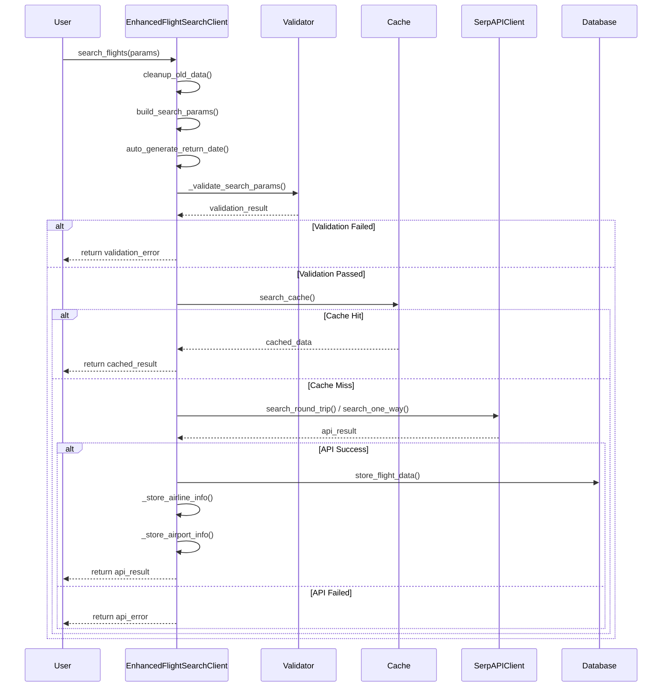

**Function Details:**
- **Purpose**: Smart flight search with cache-first strategy
- **Parameters**: 12 main parameters including departure_id, arrival_id, dates, passengers
- **Returns**: Standardized result dict with success, source, data, and metadata
- **Cache Strategy**: Checks 24-hour cache before API calls
- **Auto-features**: Auto-generates return dates, auto-validates parameters

### 2. `_extract_airline_iata_code()` - IATA Code Extraction

```mermaid
flowchart TD
    Start([Flight Number Input]) --> ValidateInput{Valid String?}
    ValidateInput -->|No| DefaultReturn[Return 'Unknown']
    ValidateInput -->|Yes| StripWhitespace[Strip Whitespace]
    
    StripWhitespace --> ApplyRegex[Apply Regex: ^([A-Z]{2,3})\s*\d+]
    ApplyRegex --> RegexMatch{Match Found?}
    
    RegexMatch -->|No| DefaultReturn
    RegexMatch -->|Yes| ExtractGroup[Extract Group 1]
    
    ExtractGroup --> ValidateLength{Length 2-3 Chars?}
    ValidateLength -->|No| DefaultReturn
    ValidateLength -->|Yes| ValidateAlpha{All Alphabetic?}
    
    ValidateAlpha -->|No| DefaultReturn
    ValidateAlpha -->|Yes| ReturnIATA[Return IATA Code]
    
    DefaultReturn --> End([End])
    ReturnIATA --> End
```

**Function Details:**
- **Purpose**: Extract 2-3 character airline IATA codes from flight numbers
- **Input**: Flight number string (e.g., "PR 216", "CX 123")
- **Output**: IATA code (e.g., "PR", "CX") or "Unknown"
- **Regex Pattern**: `^([A-Z]{2,3})\s*\d+` - Matches airline code followed by numbers
- **Validation**: Ensures extracted code is 2-3 alphabetic characters

### 3. `_store_airline_info()` & `_store_airport_info()` - Reference Data Management

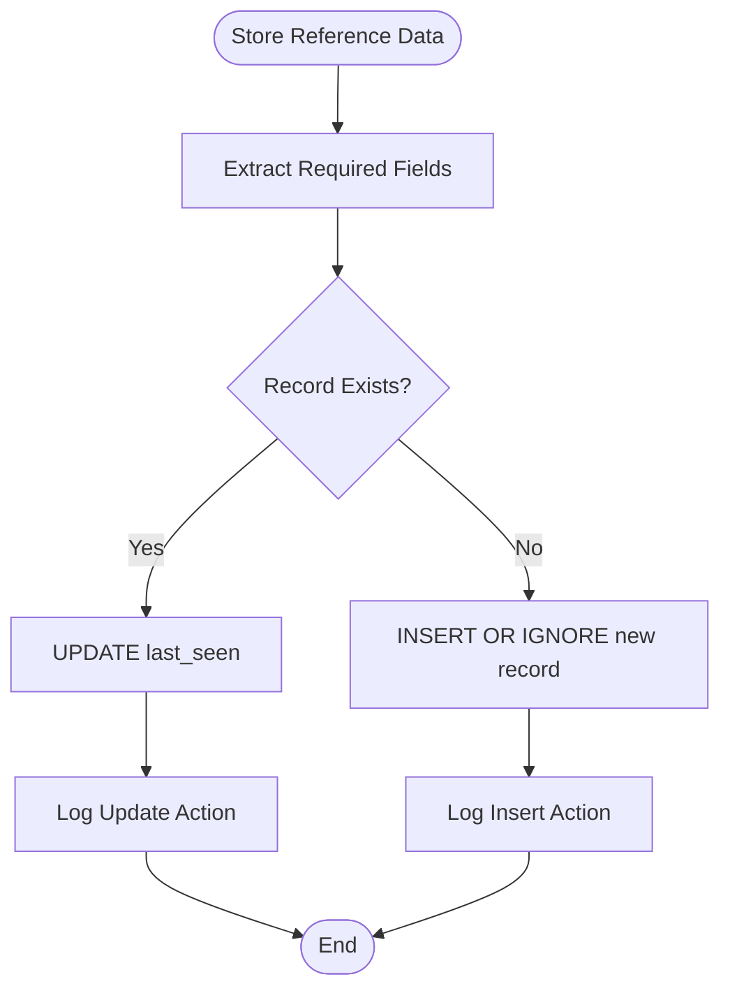

**Function Details:**
- **Purpose**: Maintain normalized reference tables for airports and airlines
- **Strategy**: INSERT OR IGNORE + UPDATE pattern for upsert functionality
- **Tracking**: Updates last_seen timestamps for existing records
- **Logging**: Comprehensive logging of all database operations

---

## 🔐 API Approval System Functions

### 1. `request_api_approval()` - Main Approval Function

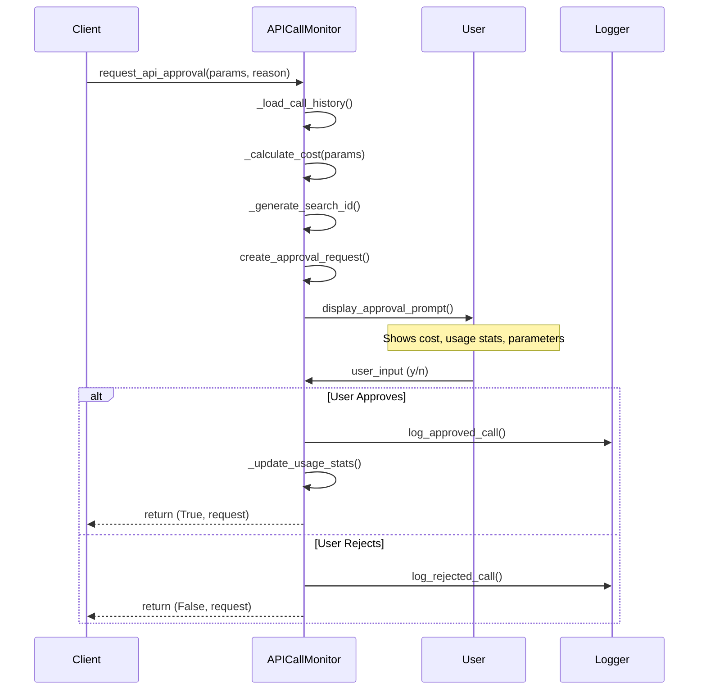

**Function Details:**
- **Purpose**: Interactive approval system for API calls with cost management
- **Cost Calculation**: $0.05 per flight search with daily usage tracking
- **User Interface**: Formatted prompt showing cost, usage, and parameters
- **Logging**: Complete audit trail of all approval decisions
- **Return**: Tuple of (should_proceed: bool, request: APICallRequest)

### 2. `generate_usage_report()` - Usage Analytics

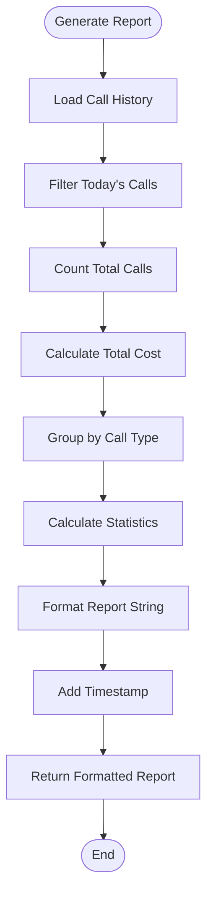

**Function Details:**
- **Purpose**: Generate comprehensive usage analytics for cost tracking
- **Metrics**: Total calls, cost breakdown, calls by type, daily trends
- **Format**: Human-readable string with emoji formatting
- **Time Range**: Configurable time periods (default: daily)

---

## 💾 Database Functions

### 1. `FlightSearchCache.search_cache()` - Cache Lookup

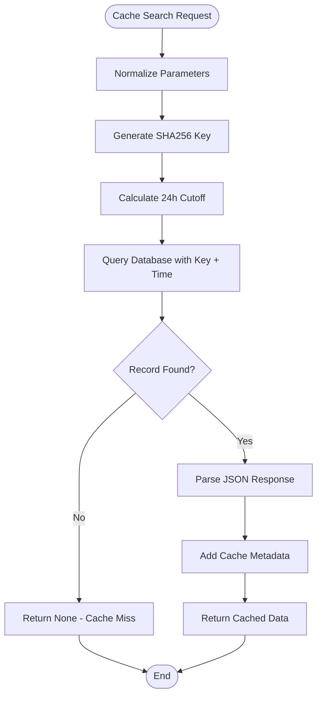

**SQL Query Used:**
```sql
SELECT fs.*, ar.raw_response, ar.query_timestamp
FROM flight_searches fs
JOIN api_queries ar ON fs.search_id = ar.search_term
WHERE fs.cache_key = ? 
  AND ar.query_timestamp > ?
ORDER BY ar.query_timestamp DESC
LIMIT 1
```

### 2. `store_flight_data()` - Data Persistence

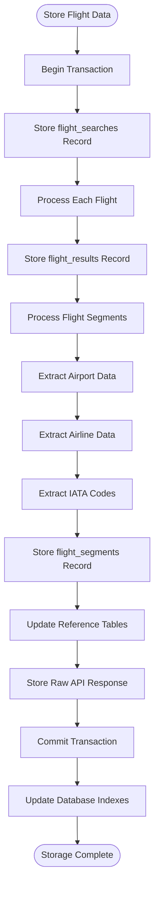

**Function Details:**
- **Atomic Operations**: Full transaction support with rollback on errors
- **Data Integrity**: Foreign key constraints maintained throughout
- **Reference Updates**: Automatic upsert of airports and airlines tables
- **Raw Preservation**: Complete API response stored for future analysis
- **Index Maintenance**: Automatic index updates for performance

### 3. `cleanup_old_data()` - Cache Maintenance

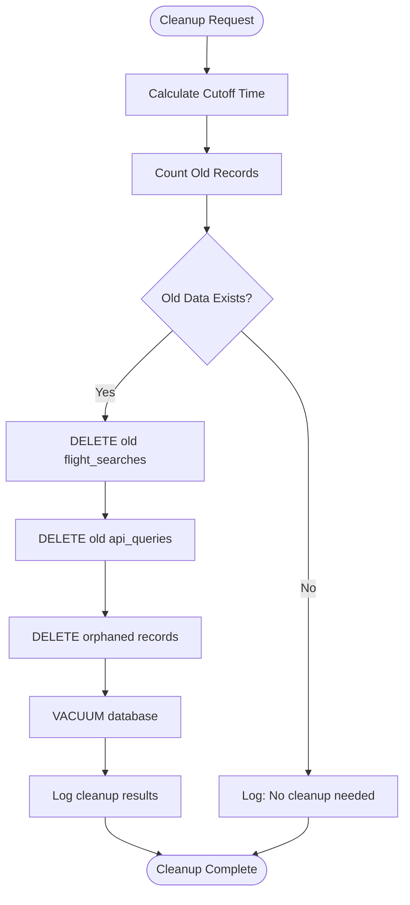

**SQL Operations:**
```sql
-- Delete old flight searches (>24 hours)
DELETE FROM flight_searches 
WHERE search_timestamp < ?

-- Delete old API queries (>24 hours)  
DELETE FROM api_queries 
WHERE query_timestamp < ?

-- Clean up orphaned records
DELETE FROM flight_results 
WHERE search_id NOT IN (SELECT search_id FROM flight_searches)
```

---

## 🌐 SerpAPI Client Functions

### 1. `search_round_trip()` - Round-trip Flight Search

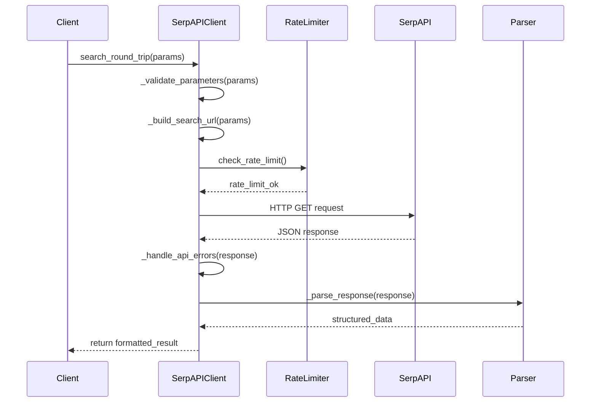

**Function Details:**
- **Parameter Validation**: Comprehensive validation of all 25+ parameters
- **URL Building**: Dynamic URL construction with proper encoding
- **Rate Limiting**: Built-in rate limiting to respect API limits
- **Error Handling**: HTTP and API error handling with retries
- **Response Parsing**: Structured parsing of complex JSON responses

### 2. `_parse_response()` - Response Processing

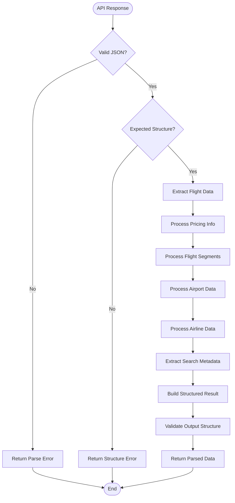

**Key Extraction Patterns:**
- **Flights**: `response['flights']` array processing
- **Prices**: Currency normalization and price extraction
- **Segments**: Departure/arrival times, airports, airlines
- **Metadata**: Search tokens, booking URLs, carbon emissions

---

## 🔄 Integration Patterns

### 1. Cache-First Search Pattern

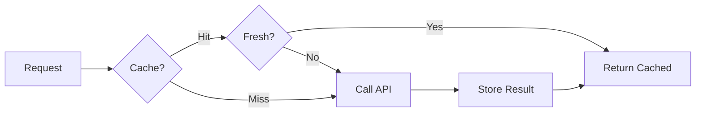

### 2. Approval Workflow Pattern

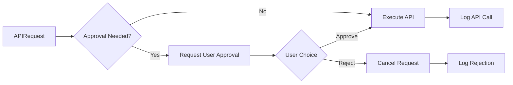

### 3. Database Transaction Pattern

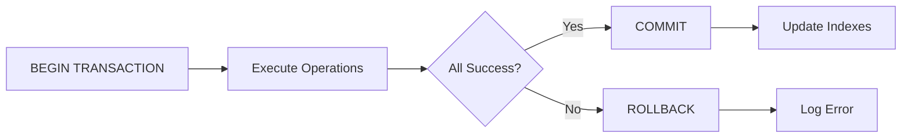

---

## 🎯 Function Dependencies

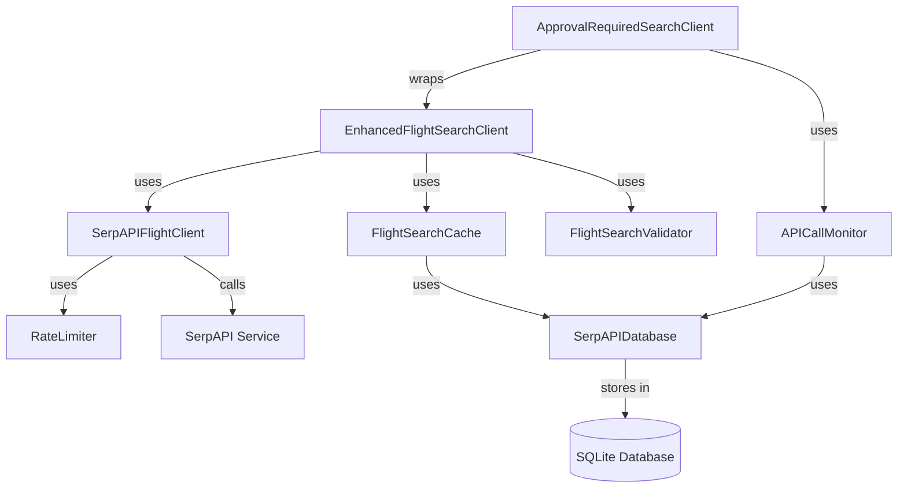

---

## 📊 Performance Metrics

### Function Execution Times (Typical)
- `search_cache()`: 5-15ms (database query)
- `search_flights()` (cache hit): 20-50ms
- `search_flights()` (API call): 2-5 seconds
- `store_flight_data()`: 50-200ms
- `request_api_approval()`: User-dependent
- `cleanup_old_data()`: 100-500ms

### Database Operations
- **Cache lookup**: Single indexed query
- **Data storage**: 5-15 INSERT operations per flight search
- **Cleanup**: Batch DELETE operations with VACUUM
- **Reference updates**: UPSERT pattern for efficiency

---

*This technical reference documents the complete function architecture of the SerpAPI Flight Search System, including detailed flow diagrams for each major component.*
